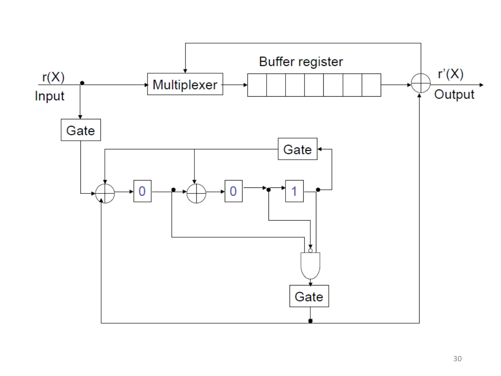

# 作業1—meggitt decoder

## 題目


## 電路架構&流程圖




<div style="page-break-after: always;"></div>

## 原理


​	$g(X)$ 為循環碼的 Generator polynomial， $c(X)$ 是code polynomial， $c(X)$ 會是 $g(X)$ 的倍數，可以寫成：
$$
c(X) = a(X)g(X)
$$
$c(X)$ 傳送出去可能有錯誤，使用 $e(X)$ 來表示 error pattern polynomial，所以接收到的 Received code polynomial（$r(X)$） 就會是：
$$
r(X)=c(X)+e(X)
$$
對著$r(X)$除以$g(X)$可以得到商式$q(X)$以及餘式$s(X)$：
$$
r(X)=q(X)g(X)+s(X) \label{r(X)}
$$
餘式 $s(X)$ 稱為 syndrome，接收端會計算出 syndrome 來估測出傳輸端的 code polynomial （$\hat{c} (X)$ ）。可以依據 syndrome 是否為 0 來判斷接收端是否有 error pattern polynomial （$e(X)$）。

> [!NOTE]
>
> syndrome's theorem:
>
> **定義** $s^{(1)}(X)$ 是 $r^{(1)}(X)$ 的 syndrome
> $$
> s^{(1)}(X)=Xs(X)\space mod\space g(X) \label{s_1}
> $$
> $r^{(1)}(X)$ 表示向右位移的 $r(X)$，$s^{(1)}(X)$ 表示向右位移的 $s(X)$
>
> proof:
> $$
> r(X)=r_{0}+r_{1}X+\cdots +r_{n-1}X^{n-1}
> $$
>
> $$
> r^{(1)}(X)=r_{n-1}+r_{0}X+r_{1}X^{2}\cdots +r_{n-2}X^{n-1}=Xr(X)+r_{n-1}(X^{n}+1) \label{r^1}
> $$
>
> 引用 ($\ref{r(X)}$) ，帶入 ($\ref{r^1}$) ，$g(X)$ 會是 $X^{n}+1$ 的因式，寫成 $X^{n}+1=g(X)h(X)$
> $$
> \begin{aligned}
> r^{(1)}(X) & = Xq(X)g(X) + Xs(X) + r_{n-1}g(X)h(X) \\ \\  & = (Xq(X)+r_{n-1})g(X) + Xs(X)
> \end{aligned}
> $$
> 還無法確認 $Xs(X)$ 是除完 $g(X)$ 的餘式，$Xs(X)$的階數可能和$g(X)$相同，所以$Xs(X)$要再除一次$g(X)$才會是餘式，這個餘式也就是 $r^{(1)}(X)$ 的 syndrome $s^{(1)}(X)$。

<div style="page-break-after: always;"></div>

​	接著說明整體流程圖，下圖是解碼的流程：


- step1：輸入r(X)
- step2：r(X) 除以 g(X) ，之後取餘數就會是 syndrome $s(X)$。
- step3：使用公式 ($\ref{s_1}$) ，利用 syndrome $s(X)$去偵測 $r^{(i)}(X)$ 的**最高位元**是否產生 error pattern $e_{n-1-i}$，並且去修正$r^{(i)}(X)$ 的**最高位元**，加上 error pattern $e_{n-1-i}$ 可以將**最高位元**翻轉成正確位元，$r(X)$ 和 $s(X)$ 位移完一圈之後（每一次都只檢查最高位元）即可將 $r(X)$ 修復完全。

> [!IMPORTANT]
>
> 因為code minimum distance 為 3，也就是能成功解出錯誤的距離（最小漢明距離）為：
> $$
> t =\left \lfloor \frac{d_{min}-1}{2}  \right \rfloor =\left \lfloor \frac{3-1}{2}  \right \rfloor = 1
> $$
> 也就是當 $r(X)$ 存在兩個以上錯誤的時候，可能會解不回去正確的訊號 $c(X)$。

可以看到[題目](#題目)中有給出不同項數的error pattern $e(X)$ ，將不同項數 $e(X)$ 除以 $g(X)$ 會得到對應的 syndrome $s(X)$ ，因為是找最高位元，所以選擇 $e_{6}(X)$ 的 syndrome $s(X)=1+x^{2}$。接著看到[電路架構](#電路架構&流程圖) GATE 端的出口，這是用來修正$r^{(i)}(X)$ 的**最高位元**，當 $r^{(i)}(X)$ 的最高位元發生錯誤時候，$r^{(i)}(X)$ 除上 $g(X)$ 會是 $e_{6}(X)$ 的 syndrome $s(X)=1+x^{2}$，所以 GATE 端要檢測餘數是否為 $1+x^{2}$ ，如果是的話 OR 閘輸出會是 1，這個 1 會加入到 $r^{(i)}(X)$ 的最高位元用來修正。

<div style="page-break-after: always;"></div>

## 程式碼

```matlab
%consider (7,4) cyclic code
r_num = 7;
g_num = 4;
%LSB g_X , MSB r_X
g_X = logical([1 1 0 1]);
r_X = logical([1 1 0 1 1 0 1]);
v_X = r_X;
error_switch = logical([zeros(1, r_num-1), ones(1, r_num+1)]);
error_current = 0;
%MSB error_compensation
error = [];
count = 0;
register = logical([0, 0, 0]);
update_register = logical([0 0 0]);
for r_in = [r_X , logical(zeros(1, r_num))]
    count = count+1;
    update_register(1) = xor(xor(register(3)&g_X(1),r_in), error_current&error_switch(count));
    update_register(2) = xor(register(3)&g_X(2),register(1));
    update_register(3) = xor(register(3)&g_X(3),register(2));
    register = update_register;
    if error_switch(count) == 1
        error_current = register(1) & (~register(2)) & register(3);
        error = [error, error_current];
        fprintf("\n========%d shift==========\n", count-7);
        fprintf("syndrome register:");disp(register);
        fprintf("buffer register:");disp(fliplr(v_X));
        fprintf("correction:%d", error_current)
        v_X(1) = xor(error_current ,v_X(1));
        v_X = circshift(v_X, -1);
    end
end
```

<div style="page-break-after: always;"></div>

## 實驗結果

$v = [1\space 0\space 0\space 1\space 0\space 1\space 1]$、$r = [1\space 0\space 1\space 1\space 0\space 1\space 1]$、 $g = [1\space 1\space 0\space 1]$

==輸出==：


