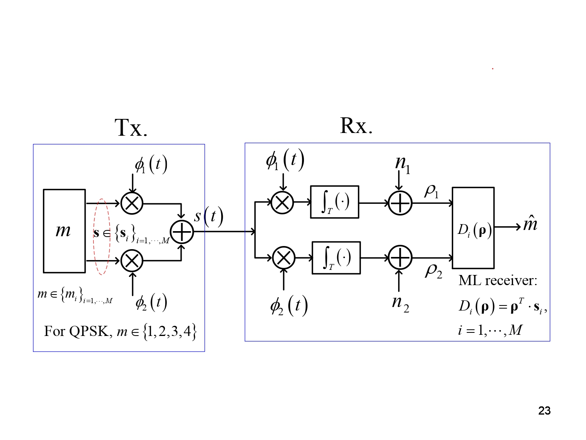
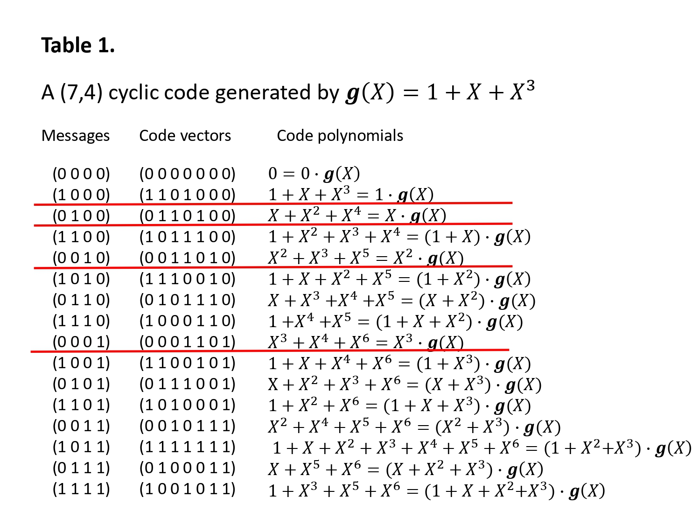
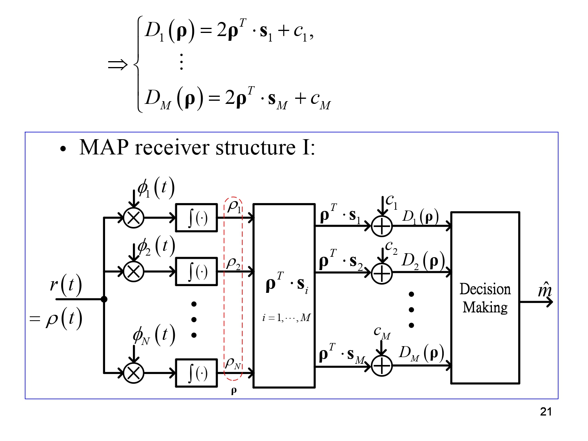
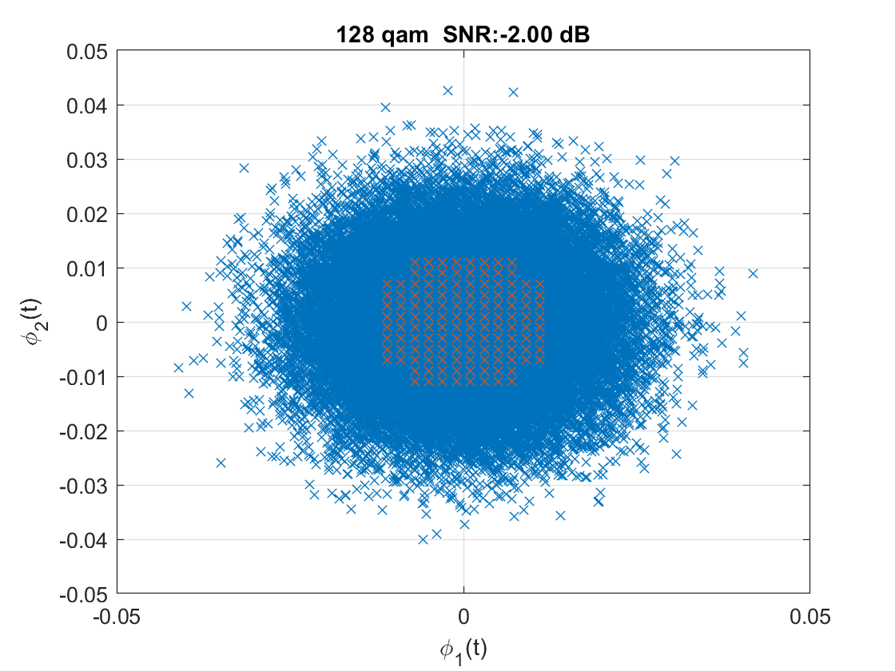
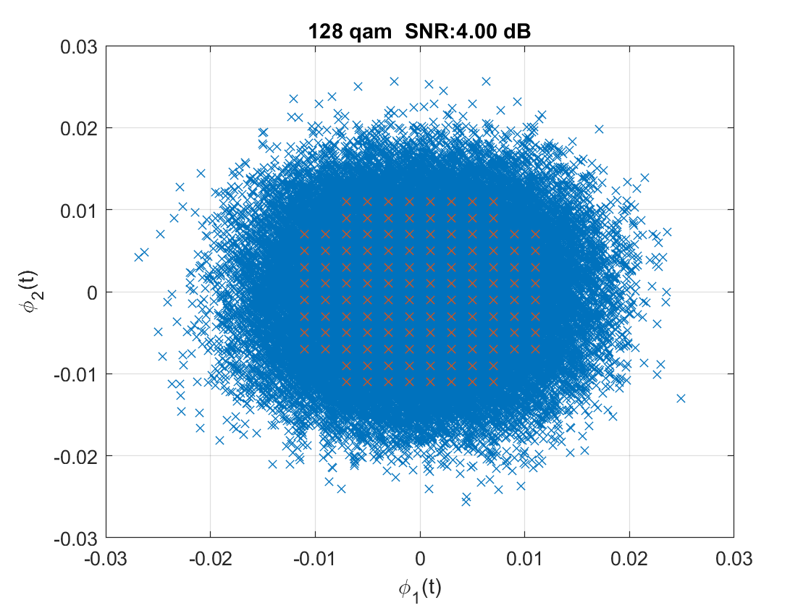
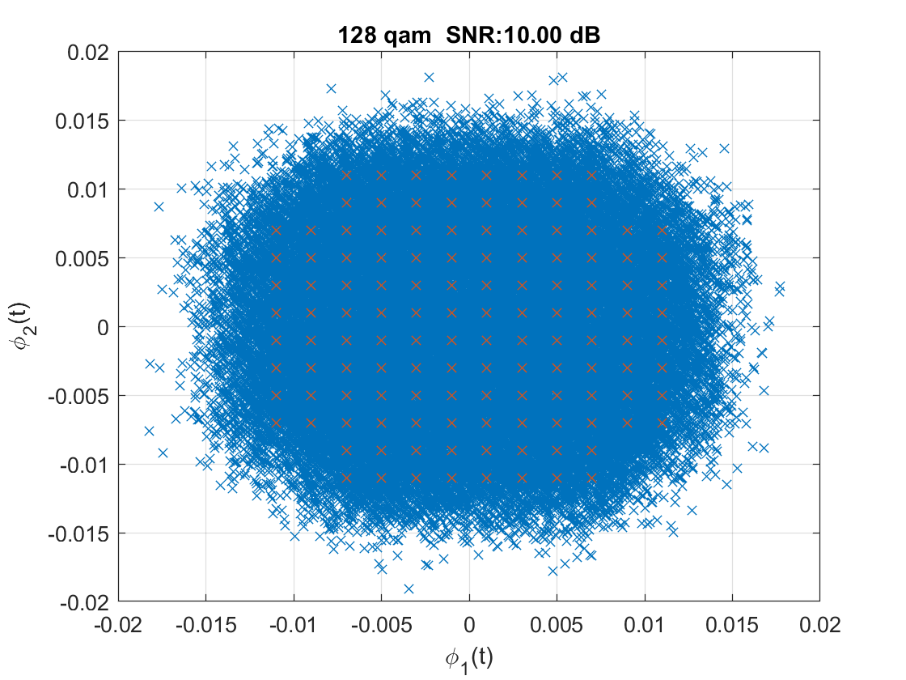
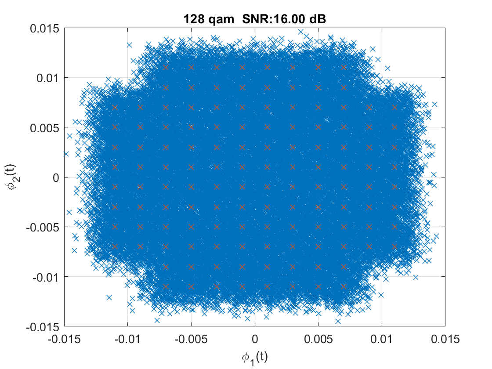
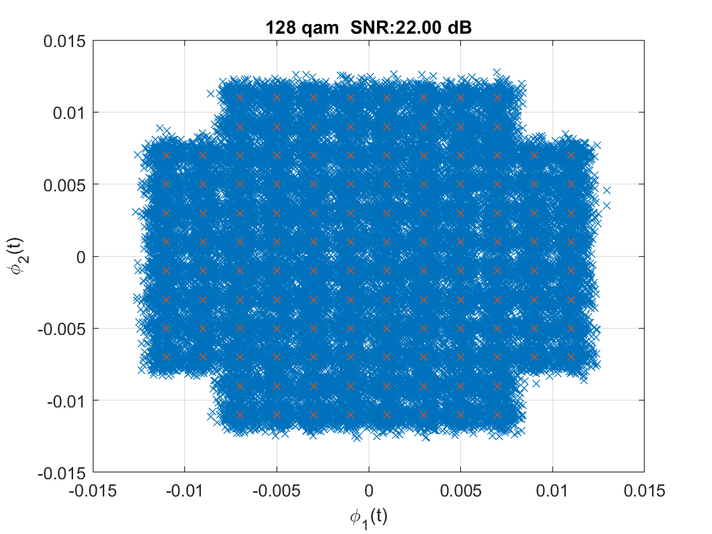
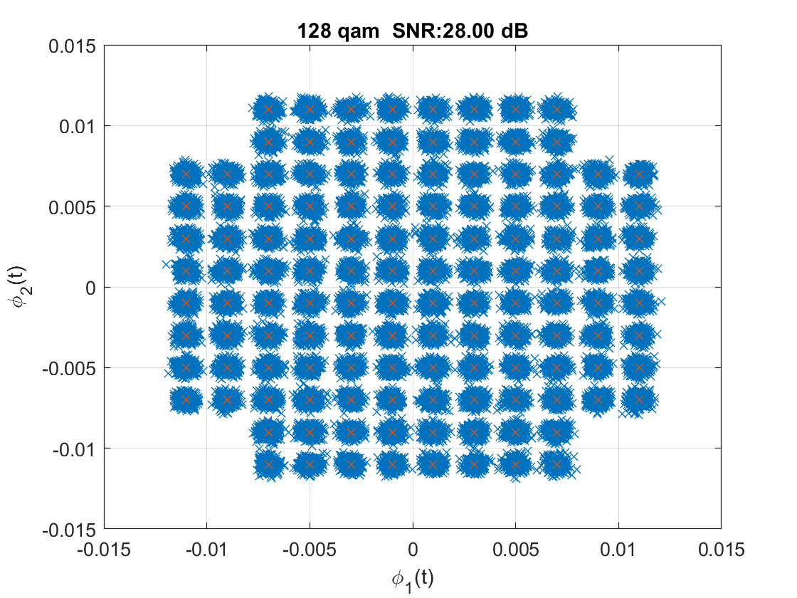
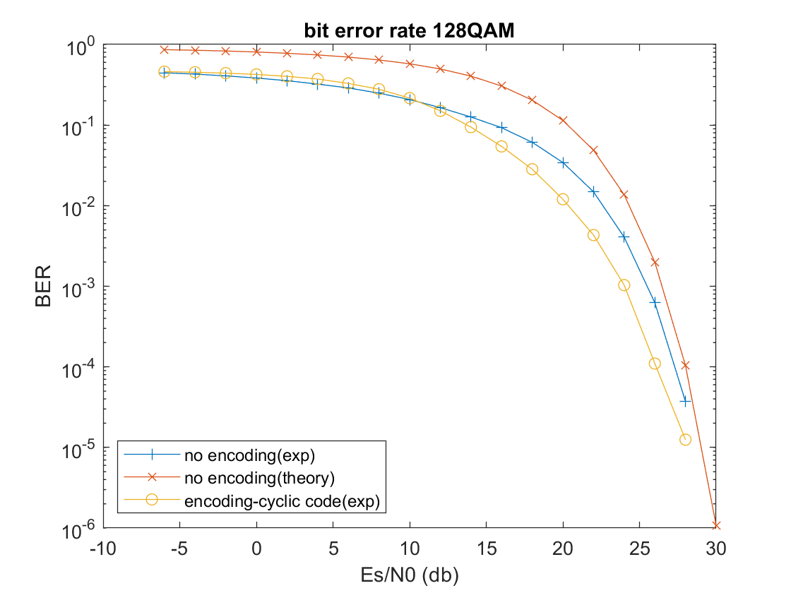

# QAM Systems with Cyclic code

​	先附上系統[傳輸架構圖](#傳輸架構圖)：

| <div style="text-align: center; font-weight: bold;" id="傳輸架構圖"> 傳輸架構圖</div> |
| :----------------------------------------------------------: |
|  |

​	將 message 用 (7,4) cyclic code （如 [(7,4) cyclic code 編碼圖](#cyclic code)）去 channel Encoder message，使用 128 QAM 傳送 Symbols 在接收端使用 ML receiver 來 demodulation Symbols ，Symbols demodulation 後的 Codewords 再使用 meggitt decoder 解回正確的 message。

| <div style="text-align: center; font-weight: bold;" id="(7,4) cyclic code 編碼圖"> (7,4) cyclic code 編碼圖</div> |
| :----------------------------------------------------------: |
|  |

<div style="page-break-after: always;"></div>

## 流程

> [!NOTE]
>
> 運行使用 `run_code` 執行


### 設置參數

```matlab
%para
fc = 3*10^(6);
Ts = 10^(-6);
a = 0.001; %wave amplitude
Es = 127*2*a*a/3;
M = 128;
sample_freq = 10^(7);
sample_time = 1/sample_freq;
No_symbols = 50000; %qam num
bit_frame = 4;
bit_num = bit_frame * No_symbols;
t = [0:sample_time:Ts-sample_time];
phi1 = sqrt(2/Ts)*cos(2*pi*fc*t);
phi2 = sqrt(2/Ts)*sin(2*pi*fc*t);
%set snr
SNR_db = 0:2:20;
SNR = 10.^(SNR_db/10); %Es/N0 = 20 (db)
N0_array = Es./SNR;
%bit error rate
Pe_ecc = [];
%ecc set
g_x = [1 1 0 1];
```

### 產生 bits stream

```matlab
%bit stream
bin_data = randsample([0 1], bit_num, true);
%S/P
bin_data_P = reshape(bin_data, bit_frame, []).';
```

​	依照設置的長度產生1 0 1 1 ...的資料流，因為是 (4,7) 的 cyclic code，所以先設置成大小(symbol數 x 4) 的 位元矩陣。

### encoding(message to codeword)

```matlab
dec_data = encoding(bin_data_P, g_x);
m = reshape(dec_data, 1, No_symbols);
```

`encoding()`

```matlab
function s_dec = encoding(s_bin, g_x) 
    %g_x = 1 + x + x^3 -> [1 1 0 1 ...]
    [rows, cols] = size(s_bin); s_dec = []; temp=[];
    for i = 1:rows
        s_bin(i, :)
        temp = mod(conv(s_bin(i, :), g_x), 2);
        temp = double(temp);
        temp = num2str(temp);
        temp = temp(~isspace(temp));
        temp = bin2dec(temp);
        s_dec = [s_dec; temp];
    end
end
```

​	將大小(symbol數 x 4) 的位元矩陣通道編碼成(symbol數 x 7)的編碼矩陣，  7位元會被轉成10進位(1 x symbol數 )。

### modulation

```matlab
m_conj = qammod(m,M);
%generate S vector (basis:phi1, phi2)
S = [];
for i = 0: M-1
    si_wave =  a*real(qammod(i,M))*phi1 + ...
        a*imag(qammod(i,M))*phi2;
    siXphi1 = si_wave .* phi1; siXphi2 = si_wave .* phi2;
    int_siXphi1 = sample_time*sum(siXphi1);
    int_siXphi2 = sample_time*sum(siXphi2);
    Si = [int_siXphi1, int_siXphi2];
    S = [S ; Si];
end
```

​	參考[傳輸架構圖](#傳輸架構圖)，使用 qammod() 將數值 0~127 mapping 到星座點上，星座點乘上基底加總一起就是傳輸訊號 $s_i$，`S` 矩陣存放 0~127 各自傳輸訊號的振幅（不同基底）。

### 經過 Channel 加雜訊

```matlab
%generate R vactor (basis:phi1, phi2)
for N0 = N0_array
    R = [];
    D = zeros(No_symbols,M);
    D_min = [];
    m_hat = [];
    for i = 1: No_symbols
        si_wave =  a*real(m_conj(i))*phi1 + a*imag(m_conj(i))*phi2;
        siXphi1 = si_wave .* phi1; siXphi2 = si_wave .* phi2;
        int_siXphi1 = sample_time*sum(siXphi1);
        int_siXphi2 = sample_time*sum(siXphi2);
        %add noise (after correlator)
        Ri = [int_siXphi1 + normrnd(0, sqrt(N0/2)), int_siXphi2 + normrnd(0,sqrt(N0/2))];
        R = [R;Ri];
    end
```

​	得到接收訊號並且使用 correlators 取出各自基底的分量(`R`)，參考[傳輸架構圖](#傳輸架構圖)。

### Demodulation

```matlab
	%generate Di
    for i = 1:M
        distance = -abs((R-S(i,:)).^(2));
        D(:, i) = distance(:, 1) + distance(:, 2);
    end
    D = D.';
    %find m_hat
    [D_max, m_hat] = max(D); m_hat = m_hat-1;
```

​	使用 MAP decision rule 找到接收訊號所在的 Decision function (因為傳輸機率相同$P(m_i)=\frac{1}{M}$，所以是 ML receiver)，可見 [MAP receiver 架構圖](#MAP receiver 架構圖)

| <div style="text-align: center; font-weight: bold;" id="MAP receiver 架構圖">MAP receiver 架構圖</div> |
| :----------------------------------------------------------: |
|  |

`m_hat` 是 demodulation 的結果 $\hat{m}$。

### decoding

```matlab
	bin_data_hat_ecc = decoding(m_hat, g_x, 1, M);
```

`decoding()`

```matlab
function bin_data_hat = decoding(r_dec, g_x, use_ecc, M)
    bin_data_hat = [];temp = []; r = [];
    [rowr, colr] = size(r_dec);
    if (use_ecc == 1)
        for i = 1:colr
            temp = meggitt_decoder(r_dec(i));
            temp = abs([mod(deconv(temp, g_x),2)]);
            bin_data_hat = [bin_data_hat, temp];
        end
    else
        r_bin = dec2bin(r_dec);
        r_bin = num2cell(r_bin);
        r_bin = cellfun(@str2double, r_bin);
        for i = 1:colr
            temp = r_bin(i, :);
            temp = abs([mod(deconv(temp, g_x),2)]);
            bin_data_hat = [bin_data_hat, temp];
        end
    end
end
```

`decoding()` 是將 codeword 解回去原本的 message。

`meggitt_decoder`

```matlab
function v_X = meggitt_decoder(r_dec)    
    %consider (7,4) cyclic code
    r_num = 7;
    g_num = 4;    
    %convert dec -> bin
    r_bin = dec2bin(r_dec);
    r_bin = num2cell(r_bin);
    r_bin = cellfun(@str2double, r_bin);
    r_bin = [zeros(1, r_num-length(r_bin)), r_bin];
    %LSB g_X , MSB r_X
    g_X = logical([1 1 0 1]);
    r_X = logical(r_bin);r_X = fliplr(r_X);
    v_X = r_X;
    error_switch = logical([zeros(1, r_num-1), ones(1, r_num+1)]);
    error_current = 0;
    %MSB error_compensation
    error = [];
    count = 0;
    pp = 0;
    register = logical([0, 0, 0]);
    update_register = logical([0 0 0]);
    for r_in = [r_X , logical(zeros(1, r_num))]
        count = count+1;
        update_register(1) = xor(xor(register(3)&g_X(1),r_in), error_current&error_switch(count));
        update_register(2) = xor(register(3)&g_X(2),register(1));
        update_register(3) = xor(register(3)&g_X(3),register(2));
        register = update_register;
        if error_switch(count) == 1
            error_current = register(1) & (~register(2)) & register(3);
            error = [error, error_current];
            % fprintf("\n========%d shift==========\n", count-7);
            % fprintf("syndrome register:");disp(register);
            % fprintf("buffer register:");disp(fliplr(v_X));
            % fprintf("correction:%d", error_current)
            if ((count-7) ~= 7)
            pp = pp+1;
            v_X(1) = xor(error_current ,v_X(1));
            v_X = circshift(v_X, -1);
            end
        end
    end
    v_X = double(fliplr(v_X));
end
```

### bit error rate 計算

```matlab
	%ber generate
    bit_errorNUM_ecc = sum((bin_data - bin_data_hat_ecc) ~= 0);
    BER_ecc = bit_errorNUM_ecc/bit_num;
    Pe_ecc = [Pe_ecc BER_ecc];
end
%calculate error rate theory
Pe_theory = 4*(1-1/sqrt(M)).*qfunc(sqrt(3*Es./((M-1).*N0_array)));
Pe_theory = M/2*Pe_theory/(M-1)
```

​	我的結果呈現三種錯誤率，第一種是沒有編碼的傳輸（程式碼參[附件](#附件)），第二種也是有使用 cyclic code 編碼，有使用 meggitt decoder來糾錯。第三種是理論錯誤率，是 128 QAM 的錯誤率，有參考蕭煒翰教授的數位通訊講義來計算。

​	首先計算 128 QAM 的平均 symbol 能量 $E_s$，參考 [QAM 平均 symbol 能量圖](#QAM 平均 symbol 能量圖)。計算出 $E_s$ 帶入 [QAM SER圖](#QAM SER圖)。有了 SER 就可以依照 [QAM 的SER、BER 關係圖](#QAM 的SER、BER 關係圖)去計算理論 128 QAM 錯誤率。

​	最後結果圖可見 [BER 比較圖](#BER 比較圖)。

| <div style="text-align: center; font-weight: bold;" id="QAM 平均 symbol 能量圖">QAM 平均 symbol 能量圖</div> | <div style="text-align: center; font-weight: bold;" id="QAM SER圖">QAM SER圖</div> |
| :----------------------------------------------------------: | :----------------------------------------------------------: |
|  |  |
| <div style="text-align: center; font-weight: bold;" id="QAM 的SER、BER 關係圖">QAM 的SER、BER 關係圖</div> |                                                              |
|  |                                                              |

## 結果探討

​	不同 SNR 下的 星座圖可以看到，在-2, 4,db可以明顯看到訊號會因為雜訊的關係跑到相鄰2格以上的星座點去了，這表示已經超出cyclic code (7,4) 能解出的最大漢明距離(1)，22, 28db可以看到點跟點之間有明顯間細，表示訊號跑到周遭1格以內的星座點佔大多數，這表示 cyclic code 可以正確解回。可以看到在 10, 16 db 下，點還不是很明確的在周遭一格附近，還是有一些訊號跑到2格以上，這也可以從 [BER 比較圖](#BER 比較圖) 明顯看到在 10 db 附近，使用cyclic code 效能慢慢比沒有編碼的好，在 10 db 以下會比較差的原因是 cyclic 會因為超過最大漢明距離解錯了，讓 error bits 比原本還多。

|  |  |
| :---------------------------------------: | :---------------------------------------: |
|  |  |
|  |  |

| <div style="text-align: center; font-weight: bold;" id="BER 比較圖">BER 比較圖</div> |
| :----------------------------------------------------------: |
|                    |

## 附件

`trans_rec_qam.m`

```matlab
%16QAM
%para
clear
fc = 3*10^(6);
Ts = 10^(-6);
a = 0.001; %wave amplitude
Es = 127*2*a*a/3;
M = 128;
sample_freq = 10^(7);
sample_time = 1/sample_freq;
No_symbols = 50000;
bit_frame = log2(M); m = [];
bit_num = bit_frame * No_symbols;
t = [0:sample_time:Ts-sample_time];
phi1 = sqrt(2/Ts)*cos(2*pi*fc*t);
phi2 = sqrt(2/Ts)*sin(2*pi*fc*t); 
%bit data
bin_data = randsample([0 1], bit_num, true);
%generate S/P
bin_data_P = reshape(bin_data, bit_frame, []).';
%bin to dec
for i = 1:No_symbols
    temp = bin_data_P(i,:);
    temp = num2str(temp);
    temp = temp(~isspace(temp));
    temp = bin2dec(temp);
    m = [m, temp];
end
m_conj = qammod(m,M);
%set snr
SNR_db = [-6:2:30];
SNR = 10.^(SNR_db/10); %Es/N0 = 20 (db)
N0_array = Es./SNR;
%bit error rate
Pe = [];
%generate S vector (basis:phi1, phi2)
S = [];
for i = 0: M-1
    si_wave =  a*real(qammod(i,M))*phi1 + a*imag(qammod(i,M))*phi2;
    siXphi1 = si_wave .* phi1; siXphi2 = si_wave .* phi2;
    int_siXphi1 = sample_time*sum(siXphi1);
    int_siXphi2 = sample_time*sum(siXphi2);
    Si = [int_siXphi1, int_siXphi2];
    S = [S ;Si];
end
%generate R vactor (basis:phi1, phi2)
for snr_i = 1:length(N0_array)
    R = [];
    D = zeros(No_symbols,M);
    D_min = [];
    m_hat = [];
    for i = 1: No_symbols
        si_wave =  a*real(m_conj(i))*phi1 + a*imag(m_conj(i))*phi2;
        siXphi1 = si_wave .* phi1; siXphi2 = si_wave .* phi2;
        int_siXphi1 = sample_time*sum(siXphi1);
        int_siXphi2 = sample_time*sum(siXphi2);
        %add noise (after correlator)
        Ri = [int_siXphi1 + normrnd(0, sqrt(N0_array(snr_i)/2)), int_siXphi2 + normrnd(0,sqrt(N0_array(snr_i)/2))];
        R = [R;Ri];
    end
    %generate Di
    for i = 1:M
        distance = -abs((R-S(i,:)).^(2));
        D(:, i) = distance(:, 1) + distance(:, 2);
    end
    D = D.';
    %find m_hat
    [D_max, m_hat] = max(D); m_hat = m_hat-1;
    %dec to bin
    r_bin = dec2bin(m_hat);
    r_bin = num2cell(r_bin);
    r_bin = cellfun(@str2double, r_bin);
    r_bin = r_bin.';r_bin = reshape(r_bin, [1, bit_num]);
    %ber generate
    bit_errorNUM = sum((r_bin - bin_data) ~= 0);
    BER = bit_errorNUM/bit_num;
    Pe = [Pe BER];
    %%look constellation===============
    % if (mod(snr_i, 3) == 0)
    %     figure;
    %     plot(R(:,1), R(:,2), 'x', S(:,1), S(:,2), 'x');
    %     title(sprintf('%d qam  SNR:%.2f dB', M, SNR_db(snr_i)))
    %     xlabel('\phi_{1}(t)') 
    %     ylabel('\phi_{2}(t)') 
    %     grid on
    % end
    %%=================================
end

Pe_no_encoding = Pe;
clearvars -except Pe_no_encoding
```

`run_code`

```
% trans_rec_qam
% trans_rec_qam_cyclic_code
figure
semilogy(SNR_db, Pe_no_encoding, '-+', SNR_db, Pe_theory, '-x', SNR_db, Pe_ecc, '-o');
title('bit error rate 128QAM'); 
xlabel('Es/N0 (db)'); 
ylabel('BER'); 
legend('no encoding(exp)', 'no encoding(theory)', 'encoding-cyclic code(exp)', 'Location', 'southwest');
```

> [!NOTE]
>
> 詳細程式參照[github](https://github.com/HoChengYun/Error-Control-Coding.git)

