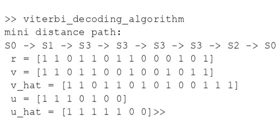

# 作業2—viterbi decoding algorithm

## 題目


## 原理

​	首先簡單介紹 convolutional code 原理，[**圖1**](#編碼示意圖) 為 Convolutional code 編碼示意圖，每個 n-bits block 有可能會和**不同段**傳送出去的 k-bits code 有關。舉個例子說，當我在編第t個輸出block，那麼它有可能會和第t, t-1,t-2個輸入block有關，可以使用  $g_{j}^{(i)}$ 來表示輸出和不同時間點輸入的關係。


<div align="center" style="font-weight: bold;" id = "編碼示意圖">圖1. Convolutional code 編碼示意圖</div>

​	如[圖2 ](#生成矩陣)為 Generator Matrix 元素的表示，$g_{j}^{(i)}$ 中的 $i$ 表示第幾個輸入 ($u_1, u_2...$) ，$j$ 代表第幾個輸出 ($v_1, v_2 ...$)，$g_{j}^{(i)}$ 當中的元素 ( a b c ) 代表和前幾個輸出有沒有關，以 $g_{1}^{(1)}$ 舉例，( 1 0 0 ) 的 1表示和 $u_1$ 當前的輸入有關，( 1 0 0 ) 第2個 0 代表和上一個輸入有關（暫存器），以此類推。


<div align="center" style="font-weight: bold;" id = "生成矩陣">圖2. Generator Matrix</div>

可以 LTI 系統來表示，可以用旋積來計算出輸出 $v_i$ （本題只有一個 $u_1$）：
$$
v_{j} = u_{1}\ast g_{j}^{(1)}+u_{2}\ast g_{j}^{(2)}+\cdots +
u_{k}\ast g_{j}^{(k)}
$$
接著可以根據暫存器內部不同的數值畫成一個 State diagram ，如[圖4](#狀態圖) 所示。


<div align="center" style="font-weight: bold;" id = "狀態圖">圖4. State diagram</div>

以 $S_1$ 來說，(1 0) 就代表當下不同暫存器的值，1 代表上個輸入的值，0 代表上上個。$u$ 是當下的輸入，$v$ 是 ($v_1, v_2$) 並在一起的結果。

​	有了以上編碼知識，接著說明解碼的流程。 使用 Optimun Decoding (MAP Decoding) 的方式，寫成方程式如 ($\ref{MAP}$) 表示。
$$
\underset{x^{(i)}}{max} \space Pr (x^{(i)}|y) \label{MAP}
$$
但是這樣的數學表示會較為複雜，可以轉換成Maximum Likelihood (ML) 來表示，如 ($\ref{ML}$) 所示。
$$
Pr (x^{(i)}|y) = \frac{Pr(x^{(i)})Pr(y|x^{(i)})}{Pr(y)} \\ 
If\space Pr(x^{(1)})=\frac{1}{M}\space \forall i,\space
Pr(x^{(i)}|y)=Pr(y|x^{(i)}) \label{ML}
$$
可以拆成每個接收 block 條件機率相乘，以[**圖1**](#編碼示意圖) 來說 L 就是 n-bits block 的數量
$$
Pr(y|x^{(i)})= {\textstyle \prod_{l=1}^{L}} Pr(y_{l}|x_{l}^{(i)})=  {\textstyle \prod_{i=1}^{L}} {\textstyle \prod_{j=1}^{n}} Pr(y_{lj}|x_{lj}^{(i)}) 
$$
接著根據收到的 $y$ 來去找機率 $Pr(y|x^{(i)})$ 最大的 $x^{(i)}$。如題目給的 $v$ 就是其中一個 $x^{(i)}$ ，$r$ 就是接收到的 $y$。 根據 $r$ 去找差異最小的 $x^{(i)}$。

​	找距離的方式使用 Metric (度量) ，公式表示如 ($\ref{metric}$)。
$$
m(x^{(i)},y)=-log(P_r(y|x^{(i)})) \label{metric}
$$

Metric的概念就是當收到最有可能的$x^{(i)}$，它的Metric會是最小的（因為有負號）。

​	State Metric 的概念是找每一層State的最短路徑，代號記為$m(S_{i,t})$。它的定義如($\ref{statemetric}$)。
$$
m(S_{i,t})=min\{ m(S_{j,t-1})+m(x^{(j)},y), \space
m(S_{k,t-1})+m(x^{(k)},y) \label{statemetric}
$$


<div align="center" style="font-weight: bold;" id = "路徑圖">圖5. 路徑圖</div>

State metric會去記錄每一層的狀態它最小的metric，也就是最有可能的狀態，最後走完全部level就會是最後近似的傳輸訊號$\hat{v}$。

## 程式碼

> [!NOTE]
>
> `viterbi_decoding_algorithm.m`：主程式
>
> `add_path.m`：找最短路徑(1 level)
>
> `decoding.m`：將收到的$r$還原回$\hat{v}$和$\hat{u}$。

**`viterbi_decoding_algorithm.m`**

```matlab
clear
path=[0]; distance = [0];
v_hat = []; u_hat = [];
r = logical([1 1 0 1 1 0 1 1 0 0 0 1 0 1]);
v = logical([1 1 0 1 1 0 0 1 0 0 1 0 1 1]);
u = logical([1 1 1 0 1 0 0]);
for k = 1: length(r)/2
    [path, distance] = add_path(path, distance, r);
end
[v_hat, u_hat] = decoding(path(1,:));
fprintf("mini distance path:\n");
for i = 1:length(path(1,:))
    fprintf("S%d",path(1,i));
    if i ~= length(path(1,:))
        fprintf(" -> ");
    end
end
fprintf("\n r = ");fprintf(mat2str(double(r)));
fprintf("\n v = ");fprintf(mat2str(double(v)));
fprintf("\n v_hat = ");fprintf(mat2str(double(v_hat)));
fprintf("\n u = ");fprintf(mat2str(double(u)));
fprintf("\n u_hat = ");fprintf(mat2str(double(u_hat)));
```

**`add_path.m`**

```matlab
function [path, distance] = add_path(path, distance, rec_signal)
    path_num = 0; level = 0; new_path = []; new_distance = [];
    temp_distance = 0; temp_output = logical([0,0]);
    rec_signal = reshape(rec_signal, [2,length(rec_signal)./2]);
    [path_num, level] = size(path);
    for i = 1:path_num
        switch path(i,end)
            case 0
                %s0->s0
                new_path = [new_path; path(i,:), 0]; %update new path
                temp_output = logical([0 0]);
                temp_distance = double(xor(temp_output(1), rec_signal(1, level)))...
                                    + double(xor(temp_output(2), rec_signal(2, level)));
                new_distance = [new_distance; distance(i) + temp_distance];
                %s0->s1
                temp_output = logical([1 1]);
                new_path = [new_path; path(i,:), 1];
                temp_distance = double(xor(temp_output(1), rec_signal(1, level)))...
                                    + double(xor(temp_output(2), rec_signal(2, level)));
                new_distance = [new_distance; distance(i) + temp_distance];
            case 1
                %s1->s2
                temp_output = logical([1 0]);
                new_path = [new_path; path(i,:), 2]; %update new path
                temp_distance = double(xor(temp_output(1), rec_signal(1, level)))...
                                    + double(xor(temp_output(2), rec_signal(2, level)));
                new_distance = [new_distance; distance(i) + temp_distance];
                %s1->s3
                temp_output = logical([0 1]);
                new_path = [new_path; path(i,:), 3];
                temp_distance = double(xor(temp_output(1), rec_signal(1, level)))...
                                    + double(xor(temp_output(2), rec_signal(2, level)));
                new_distance = [new_distance; distance(i) + temp_distance];
            case 2
                %s2->s0
                temp_output = logical([1 1]);
                new_path = [new_path; path(i,:), 0]; %update new path
                temp_distance = double(xor(temp_output(1), rec_signal(1, level)))...
                                    + double(xor(temp_output(2), rec_signal(2, level)));
                new_distance = [new_distance; distance(i) + temp_distance];
                %s2->s1
                temp_output = logical([0 0]);
                new_path = [new_path; path(i,:), 1];
                temp_distance = double(xor(temp_output(1), rec_signal(1, level)))...
                                    + double(xor(temp_output(2), rec_signal(2, level)));
                new_distance = [new_distance; distance(i) + temp_distance];
            case 3
                %s3->s2
                temp_output = logical([0 1]);
                new_path = [new_path; path(i,:), 2]; %update new path
                temp_distance = double(xor(temp_output(1), rec_signal(1, level)))...
                                    + double(xor(temp_output(2), rec_signal(2, level)));
                new_distance = [new_distance; distance(i) + temp_distance];
                %s3->s3
                temp_output = logical([1 0]);
                new_path = [new_path; path(i,:), 3];
                temp_distance = double(xor(temp_output(1), rec_signal(1, level)))...
                                    + double(xor(temp_output(2), rec_signal(2, level)));
                new_distance = [new_distance; distance(i) + temp_distance];
        end
    end
        %delete long distance path
        same_index = 0; min_index = 0; min_distance = 0;
        %clear distance & path
        distance = []; path = [];
        for check = 0:3
            same_index = find(new_path(:,end) == check);
            if length(same_index) == 1
                distance = [distance; new_distance(same_index)];
                path = [path; new_path(same_index,:)];
                continue
            end
            %min_index : index of same_index
            [min_distance, min_index] = min(new_distance([same_index]));
            distance = [distance; min_distance];
            path = [path; new_path(same_index(min_index),:)];
        end
end
```

**`decoding.m`**

```matlab
function [v_hat, u_hat] = decoding(path)
u_hat = []; v_hat = [];
    for i = 1:length(path)-1
        switch path(i)
            case 0
                if path(i+1) == 0
                    v_hat = [v_hat, logical([0 0])];
                    u_hat = [u_hat, logical([0])];
                elseif path(i+1) == 1
                    v_hat = [v_hat, logical([1 1])];
                    u_hat = [u_hat, logical([1])];
                end
            case 1
                if path(i+1) == 2
                    v_hat = [v_hat, logical([1 0])];
                    u_hat = [u_hat, logical([0])];
                elseif path(i+1) == 3
                    v_hat = [v_hat, logical([0 1])];
                    u_hat = [u_hat, logical([1])];
                end
            case 2
                if path(i+1) == 0
                    v_hat = [v_hat, logical([1 1])];
                    u_hat = [u_hat, logical([0])];
                elseif path(i+1) == 1
                    v_hat = [v_hat, logical([0 0])];
                    u_hat = [u_hat, logical([1])];
                end
            case 3
                if path(i+1) == 2
                    v_hat = [v_hat, logical([0 1])];
                    u_hat = [u_hat, logical([0])];
                elseif path(i+1) == 3
                    v_hat = [v_hat, logical([1 0])];
                    u_hat = [u_hat, logical([1])];
                end
        end
end
```

## 實驗結果

- 輸入

  `r = logical([1 1 0 1 1 0 1 1 0 0 0 1 0 1]);`

  `v = logical([1 1 0 1 1 0 0 1 0 0 1 0 1 1]);`

  `u = logical([1 1 1 0 1 0 0]);`

  只會使用`r`去計算。

- 輸出

  

  第4個位元沒有成功解出來。
